```{r setup, include=FALSE}
knitr::opts_chunk$set(echo = FALSE)
```

## Introduction

In this DataViz Makeover, we shall be critiquing the following data visualisation in terms of **clarity** and **aesthetic**, before suggesting an alternative graphical presentation to improve on the data visualisation. The proposed alternative data visualisation will be designed in **Tableau** with the step-by-step description on how to do so listed below. Lastly, important observations will be noted based on the new visualisation created.

### Data Visualisation

```{r out.width='3500px', out.extra='style="float:left; padding:10px"', echo = FALSE}
knitr::include_graphics("image.png")


```
  
*Fig 1. Data visualisation based on data provided by Ministry of Manpower, Singapore (MOM)*


### Clarity

A data visualisation's clarity is based on how quickly and effectively it imparts to the audience an accurate understanding of the data. There are many ways that this could be done, be it through deft manipulation of cognitive load or types of charts used to best display the insights. In this section, we will be analysing the data visualisation and commenting on its clarity.


**1) Lack of annotations**

There are a lack of annotations to highlight key points in the data visualisation. Viewers who look at the data visualisation may find it hard to extract key insights on their own, and it would be better for certain annotations to be placed on the chart to better draw their attention towards.

```{r out.width='3500px', out.extra='style="float:left; padding:10px"', echo = FALSE}
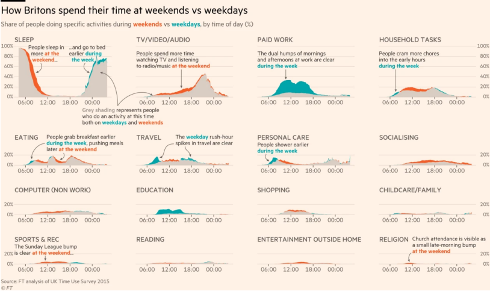


```
*Fig 2. An example of a chart with annotations*

As shown above, the annotations help to explain concepts better and add **clarity** to the visualisation. It would be appropriate to include annotations in the data visualisation to explain certain points further.


**2) Trend displayed and X-axis (Age Group) were incongruent**

In the data visualisation, the graph showed an upward trend going from left to right. As the human brain tends to perceive increasing amounts when looking at an X-axis from left to right, viewers would naturally assume that the age groups are in ascending order as well from left to right on the X-axis. However, this is not the case in this data visualisation, where the age groups are jumbled up based on their LFPR. Hence, the data visualisation may confuse viewers into erroneously thinking that certain age groups have the highest LFPR.


**3) Chart type used to display information**

Line charts and area charts are both good for time series data and both show continuity across a dataset. 

In this data visualisation, an area chart was used to track changes over time for the different age groups. However, it was difficult to see the changes in LFPR over time for each individual age group. 

It would be more appropriate to use a line chart to show the multiple age groups and compare them against each other.

### Aesthetic

Aesthetic qualities of a data visualisation can often be utilised as well to increase the overall impact of the point being driven across. Such aesthetic properties can include font, color or annotations. In this section, we will be analysing the data visualisation and commenting on its aesthetic qualities.


**1) Improper labeling of x and y-axis as well as title of data visualisation**

The X-axis (Year) was erroneously labeled 2015 when the time period used was actually from 2010 to 2021.

The Y-axis was simply labeled *Lfpr*. To viewers who may not be familiar with the abbreviation, they may not be able to understand what the data visualisation is telling them. Also, Labour Force Participation Rate (LFPR) is measured in percentages, which is not indicated clearly on the Y-axis. Lastly, the title was unclear on what was being compared, and it would be more appropriate to include the comparing variable, such as "Labour Force Participation Rate by Age Group".


**2) Lack of Pre-Attentive Principles**

A pre-attentive visual property is one which is processed in spatial memory without our conscious action. This makes it easier for a user to understand various designs and concepts by simply varying such properties, which include *colour*, *form*, *movement* and *spatial positioning*. 

The data visualisation employs an excessive use of colours which can confuse the viewers. The excessive use of colours makes it hard for the viewer to discern what is the key message that is being brought out by the visualisation. Instead, it would be more appropriate to either use one or two colours to highlight key information instead of a vast array of colours.


**3) Aesthetics of X and Y-axis**

The labels for the X-axis were age groups, but some age group labels were truncated which led to difficult reading of the visualisation. For example, the age group *75 & Over* was truncated and viewers may not know the exact age group without having prior knowledge of the data. 

The Y-axis could be further improved with tick marks for every 10% for the Labour Force Participation Rate in order to show finer details and trends over time.


## Proposed Design

```{r out.width='3500px', out.extra='style="float:left; padding:10px"', echo = FALSE}
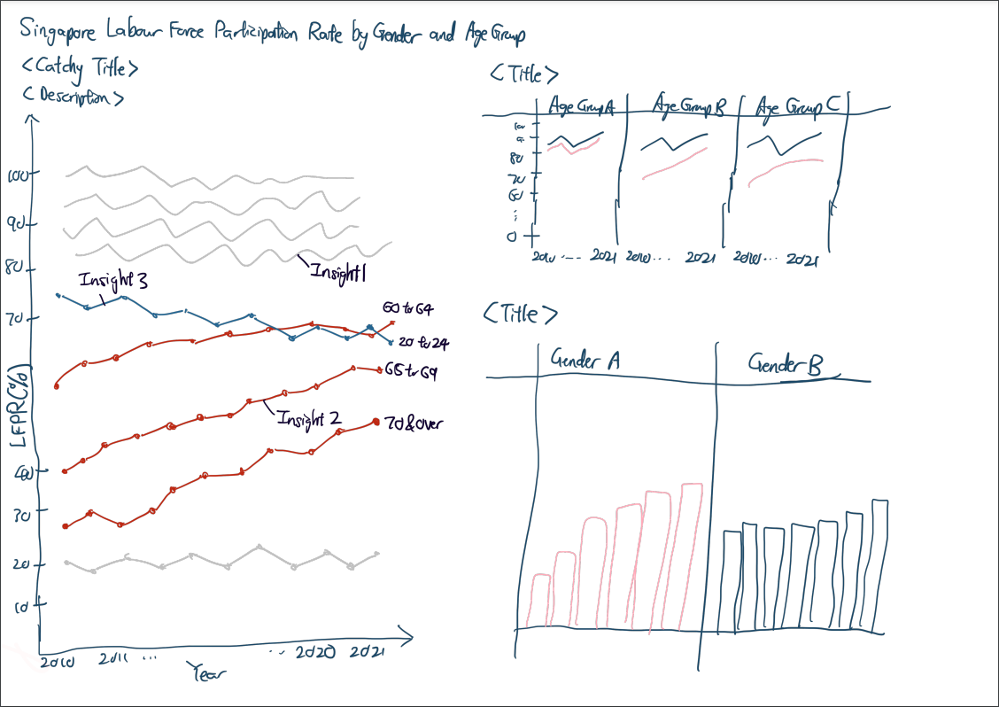


```

The proposed sketch has several advantages and also helps to tackle some of the shortcomings of the old visualisation:

### Clarity

1) The sketch provides annotations to explain insights as well as particular noteworthy trends. This helps the reader understand the visualisation at first glance and not attempt to guess at what the author might be trying to hint at.

2) In the proposed sketch, the age groups were properly labeled in ascending order, and important age groups were highlighted so as to reduce visual load for the viewer.

3) The chart type was changed to a line chart to showcase the changes in LFPR over time for several age groups. This allows for multiple age groups to
be on the same x-axis and reduces the need for splitting the data visualisation into multiple sections each for different age groups.


### Aesthetic

1) The axes were properly labeled, with LFPR spelt in full and the Years shown correctly. Also, a proper title is included in order to give viewers an overall idea of what the visualisation is about. A catchy subtitle is also included to attract the attention of viewers.

2) In all of the charts, a maximum of two colours were used to reduce visual load on the viewers. Additionally, pre-attentive principles were used such as using color amidst greyscale to highlight certain statistics and make the insight "pop" out more to viewers.

3) The y-axis, which was the Labour Force Participation Rate, was refined to include tick marks of 5% to show finer details and the trends more clearly.

## Step-By-Step Preparation of Data Visualisation

### Step 1: Data Processing using Excel

A closer look at the raw data provided shows the information organised in a table neatly. However, to allow **Tableau** to read the data easily, the raw data will need to be pivoted. In this exercise, we will be using data from both the **mrsd_Res_LFPR_1** and the **mrsd_Res_LFPR_2** tab from the raw data.

```{r out.width='3500px', out.extra='style="float:left; padding:10px"', echo = FALSE}
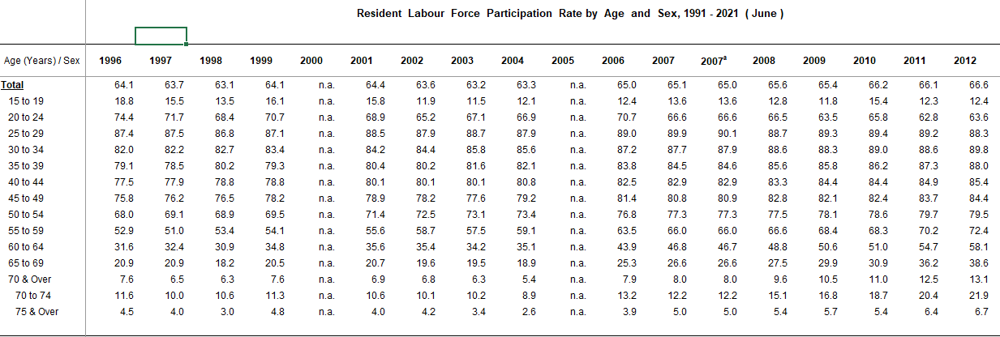


```
*Fig 3. An example of the raw data provided*

The first step will be to create a new Excel workbook for our data. We will be creating three separate sheets, one for **Total by Age Group**, one for **Total by Gender**, and one for **Age Group and Gender**.

```{r out.width='3500px', out.extra='style="float:left; padding:10px"', echo = FALSE}
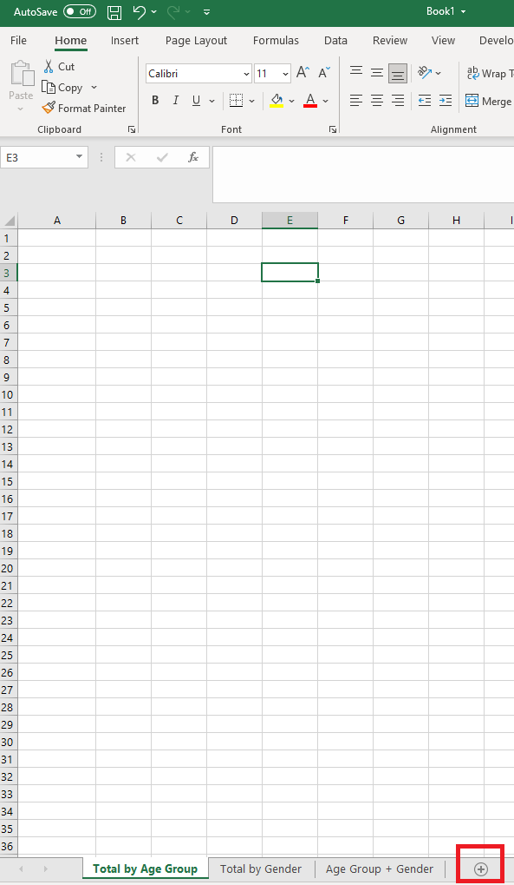


```
*Fig 4. Creating new sheets in Excel*

Click on the icon highlighted to create a new sheet, and right click on each tab in order to rename them.

In the Total by Age Group tab, we will be creating the following columns as such:

```{r out.width='3500px', out.extra='style="float:left; padding:10px"', echo = FALSE}
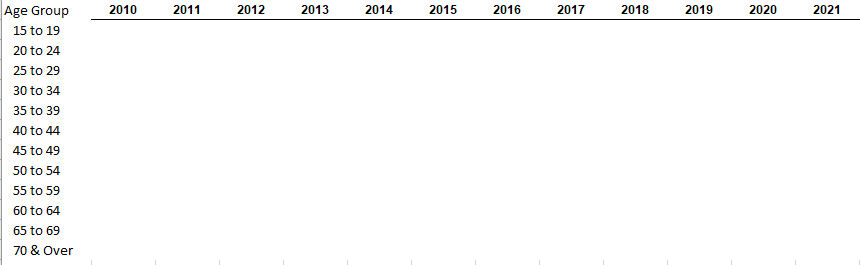


```
*Fig 5. Creating the columns in Excel*

The first column will contain the age group, and the first row will contain the years from 2010 to 2021.

Next, we will copy over the raw data from *mrsd_Res_LFPR_2* tab corresponding to the *Total* section over.

```{r out.width='3500px', out.extra='style="float:left; padding:10px"', echo = FALSE}
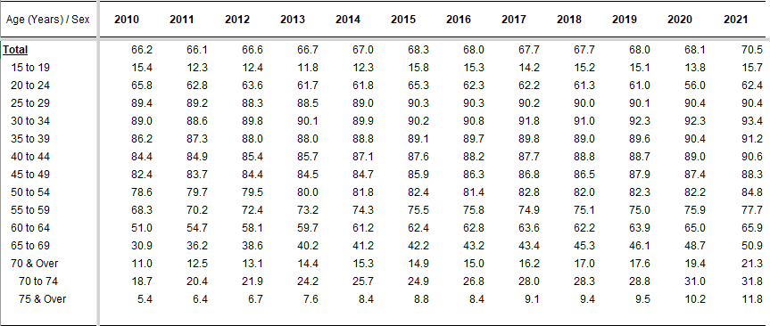


```
*Fig 6. Data to copy over*

```{r out.width='3500px', out.extra='style="float:left; padding:10px"', echo = FALSE}
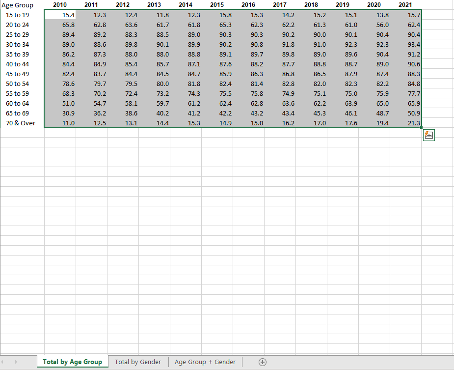


```
*Fig 7. Data copied over to the Total by Age Group tab*

Next, we would like to extract out data for the other tabs, **Total by Gender** and **Age Group + Gender**. For **Total by Gender**, we will be creating the columns as such in the tab.

```{r out.width='3500px', out.extra='style="float:left; padding:10px"', echo = FALSE}
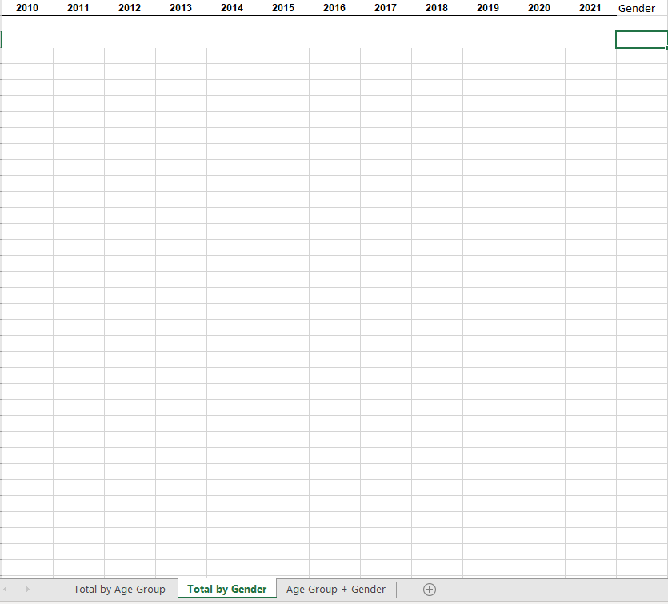


```
*Fig 8. Creating the columns in Excel*

Next, we will copy over the information for the Total LFPR for Males and Females for the years 2010 - 2021, as shown below:

```{r out.width='3500px', out.extra='style="float:left; padding:10px"', echo = FALSE}
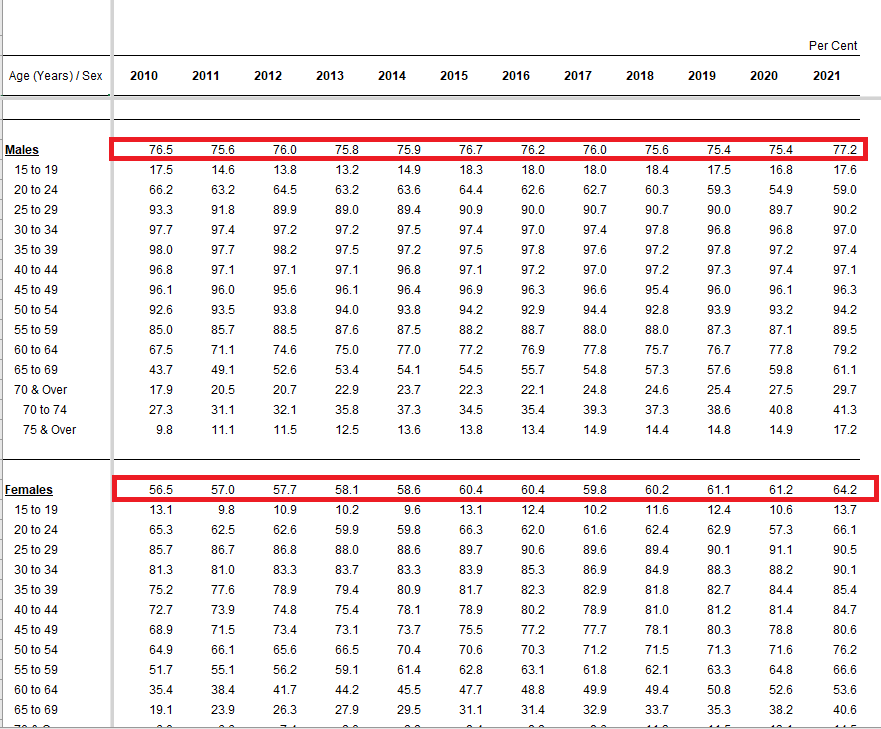


```
*Fig 9. Data to copy over*

```{r out.width='3500px', out.extra='style="float:left; padding:10px"', echo = FALSE}
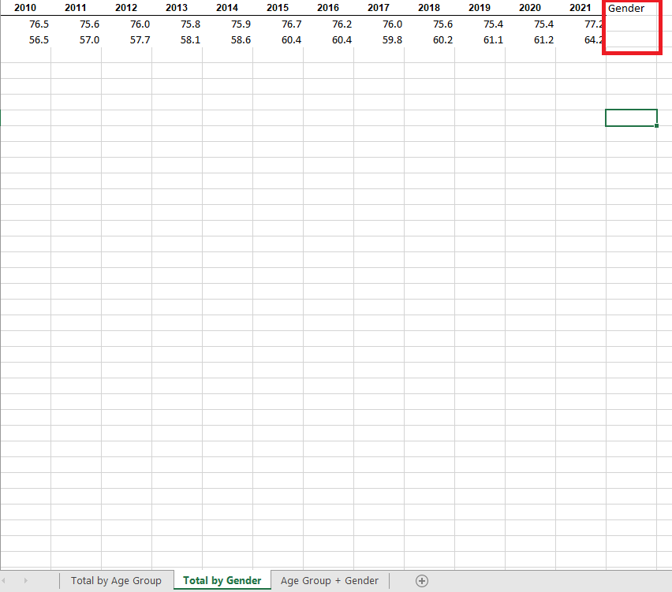


```
*Fig 10. Data copied over to the Total by Gender tab*

Lastly, as highlighted in the red box for the image above, we will be filling in the Gender for each row.

```{r out.width='3500px', out.extra='style="float:left; padding:10px"', echo = FALSE}
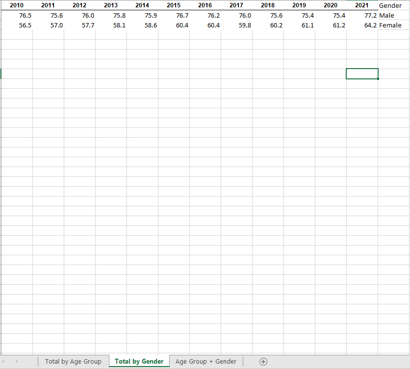


```
*Fig 11. Final Total by Gender tab*


For the last tab, **Age Group + Gender**, we will create the columns as such:

```{r out.width='3500px', out.extra='style="float:left; padding:10px"', echo = FALSE}
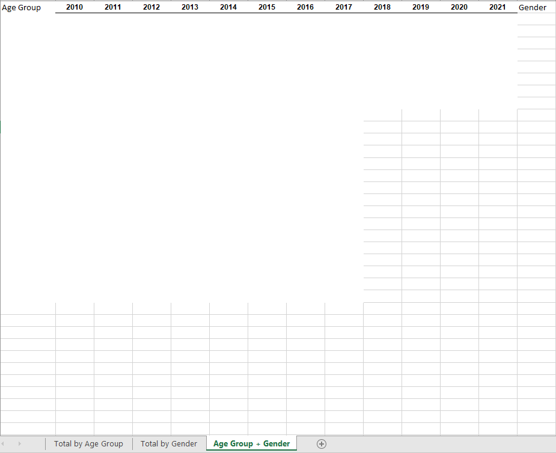


```
*Fig 12. Creating the columns in Excel*

This time, we will be copying over the data in the *mrsd_Res_LFPR_1* tab over.

```{r out.width='3500px', out.extra='style="float:left; padding:10px"', echo = FALSE}
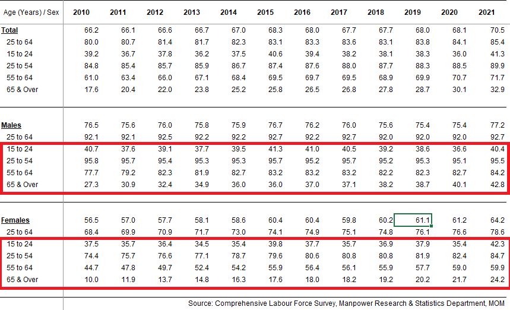


```
*Fig 13. Data to copy over*

```{r out.width='3500px', out.extra='style="float:left; padding:10px"', echo = FALSE}
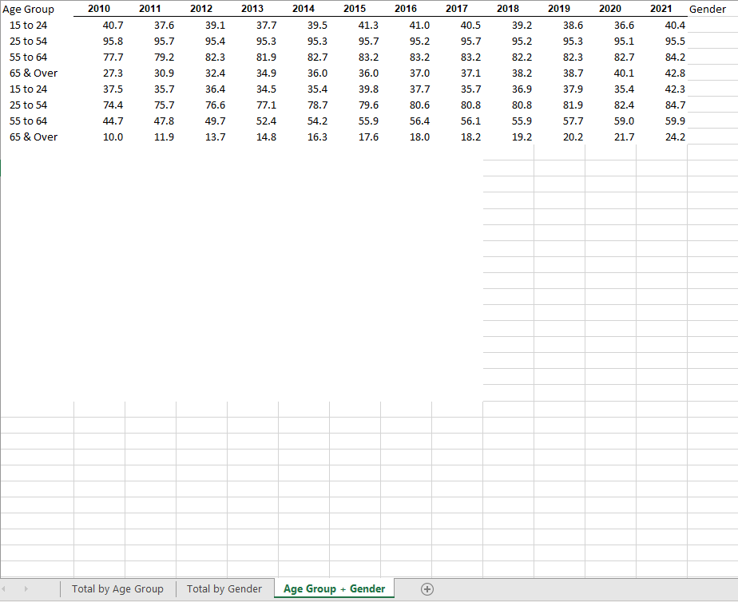


```
*Fig 14. Data copied over to the Age Group + Gender tab*

And lastly, we will be filling in the Gender for each row.

```{r out.width='3500px', out.extra='style="float:left; padding:10px"', echo = FALSE}
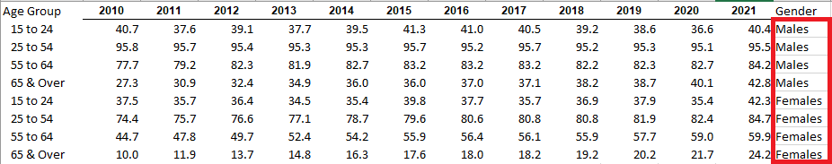


```
*Fig 15. Final Age Group + Gender*

Lastly, we will save this Excel workbook in an accessible location.


### Step 2: Importing the data in Tableau

Open up the Tableau application and import the Excel file through here: 


```{r out.width='3500px', out.extra='style="float:left; padding:10px"', echo = FALSE}
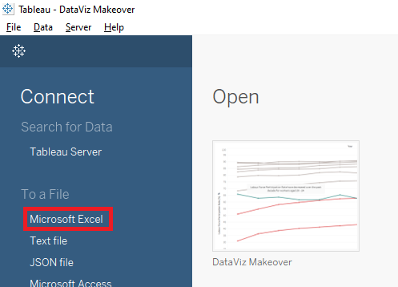


```
*Fig 16. Importing Excel File through Tableau*

You will arrive at this screen, drag the Total by Age Group onto the blank space on the right.

```{r out.width='3500px', out.extra='style="float:left; padding:10px"', echo = FALSE}
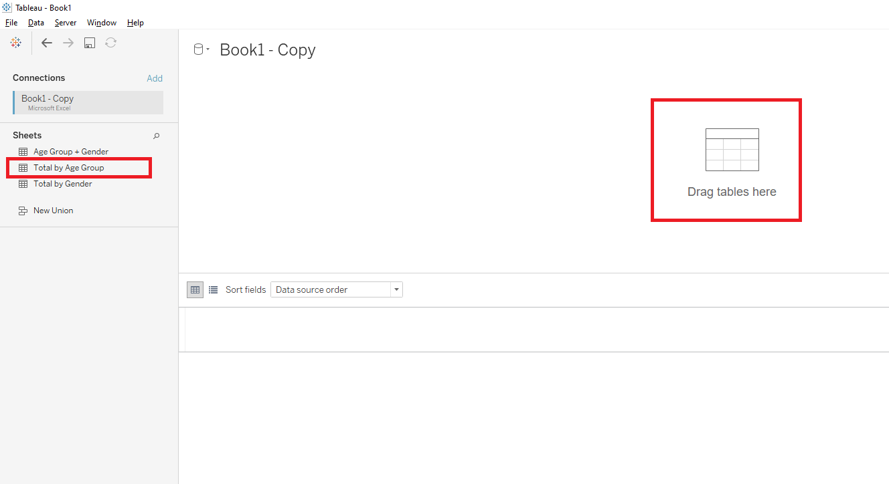


```
*Fig 17. Creating data table*

Next, click on the small arrow beside *Total by Age Group* and select **Field names are in first row**.

```{r out.width='3500px', out.extra='style="float:left; padding:10px"', echo = FALSE}
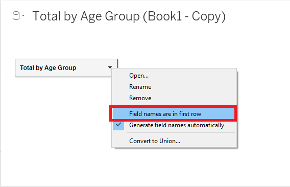


```
*Fig 18. Adjusting the data table to read the correct rows*

Next, left click on the column *2010* and Shift+Left click on the column *2021*. Right click and select Pivot. Next, rename *Pivot Field Names* as *Year* and *Pivot Field Values* as *Labour Force Participation Rate (%)*.

```{r out.width='3500px', out.extra='style="float:left; padding:10px"', echo = FALSE}
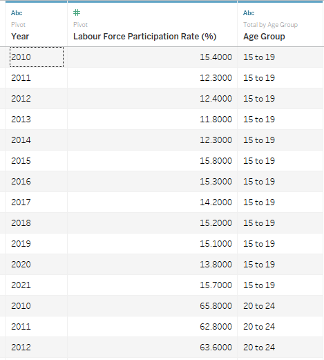


```
*Fig 19. Pivoting the data*


Next, we shall create two more data tables for the other two tabs that we have in our Excel file. Select *Data* at the top of the Tableau bar and click on *New Data Source*. Import the Excel file again, but this time dragging the *Total by Gender* to the blank space.

Next, click on the small arrow beside *Total by Gender* and select **Field names are in first row**.

Next, left click on the column *2010* and Shift+Left click on the column *2021*. Right click and select Pivot. Next, rename *Pivot Field Names* as *Year* and *Pivot Field Values* as *Labour Force Participation Rate (%)*.

Repeat the above for the *Age Group + Gender* tab.


### Step 3: Creating *Total by Age Group* Sheet

Create 3 seperate sheets in Tableau on the bottom left corner and re-label them *Total by Age Group*, *Total by Gender* and *Age Group + Gender*

For the first sheet, *Total by Age Group*, we will be selecting the *Total by Age Group* data source as shown:

```{r out.width='3500px', out.extra='style="float:left; padding:10px"', echo = FALSE}
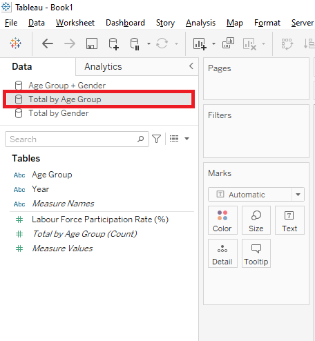


```
*Fig 20. Selecting the appropriate data source*

Next, we will drag the *Year* card into Columns, the *Labour Force Participation Rate (%)* card into Rows, and *Age Group* into Colors.

```{r out.width='3500px', out.extra='style="float:left; padding:10px"', echo = FALSE}
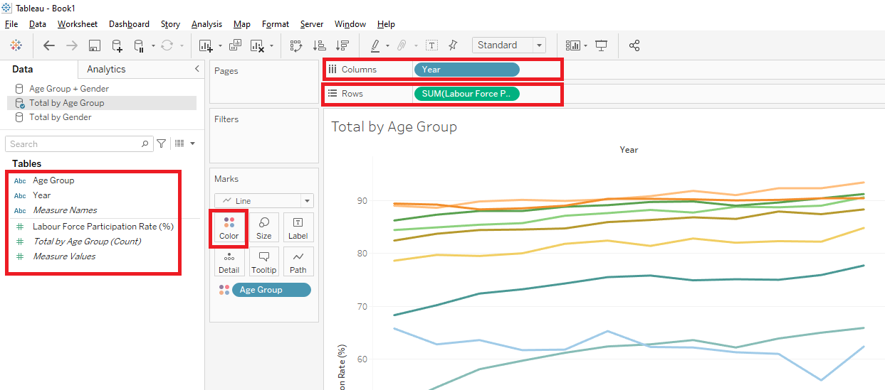


```
*Fig 21. Creating the visualisation*

Next, we would like to highlight only certain colours on the line chart to show insights on the visualisation. Right click on one of the colours on the Age Group card on the right, and select Edit Colors.

```{r out.width='3500px', out.extra='style="float:left; padding:10px"', echo = FALSE}
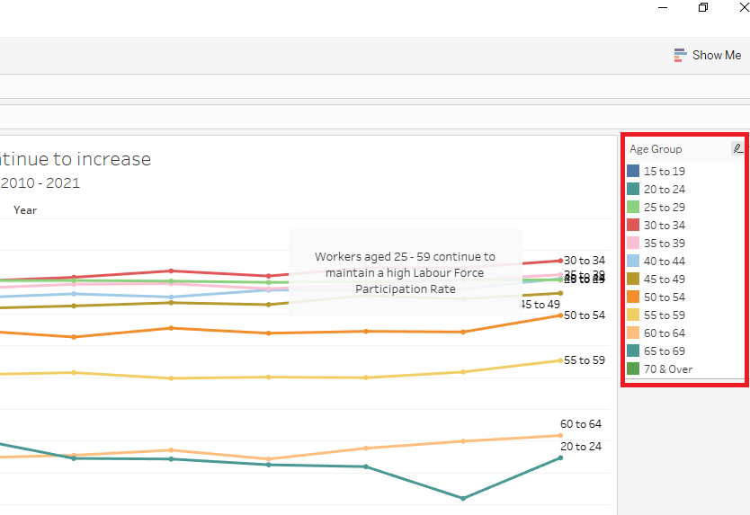


```
*Fig 22. Editing Colours*

```{r out.width='3500px', out.extra='style="float:left; padding:10px"', echo = FALSE}
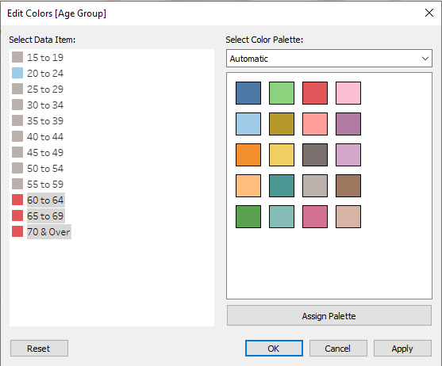


```
*Fig 23. Editing Colours*

We will highlight the age group *20 to 24* as blue and ages 60 and above as red.


Lastly, we can edit the title, axes, as well as create annotations by right-clicking and selecting Annotate >> Area.

### Step 4: Creating *Total by Gender* Sheet

Similar to the previous sheet, we will first select the data source, followed by dragging the respective marks to their respective locations, then editing the colours. 

```{r out.width='3500px', out.extra='style="float:left; padding:10px"', echo = FALSE}
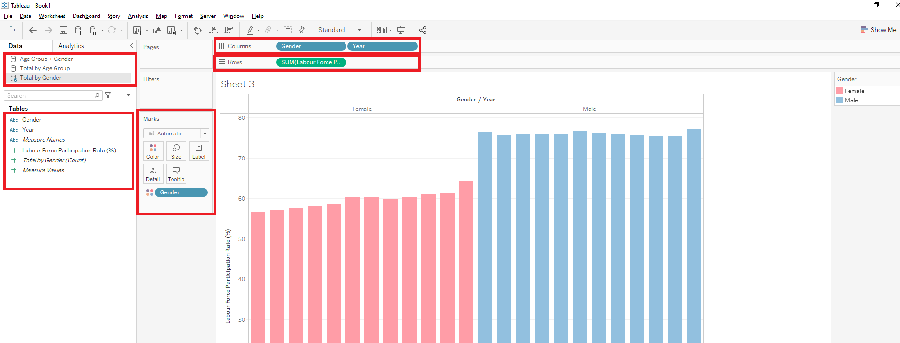


```
*Fig 24. Creating the visualisation*

We can edit the title, axes, as well as create annotations by right-clicking and selecting Annotate >> Area.

### Step 5: Creating *Age Group and Gender* Sheet

Lastly, we will create the *Age Group and Gender* sheet and select the data source, followed by dragging the respective marks to their respective locations. On the left side, we will be changing one of the tabs to Area chart and leaving the other as Line chart.

```{r out.width='3500px', out.extra='style="float:left; padding:10px"', echo = FALSE}
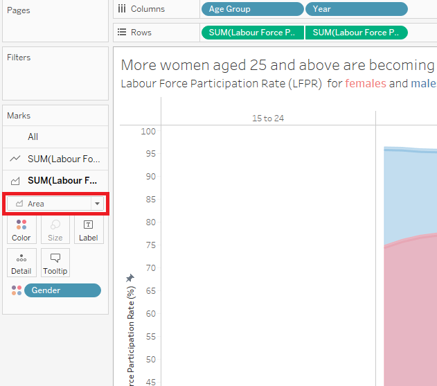


```

```{r out.width='3500px', out.extra='style="float:left; padding:10px"', echo = FALSE}
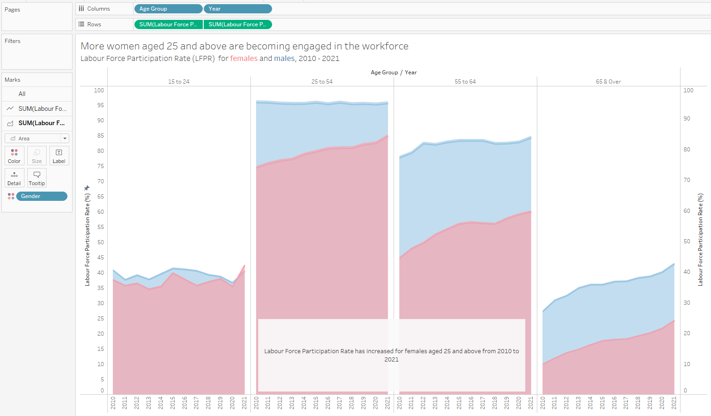


```
*Fig 25. Creating the visualisation*

We can edit the title, axes, as well as create annotations by right-clicking and selecting Annotate >> Area.


### Step 6: Combining the visualisations into a dashboard

In order to piece together the visualisations into a dashboard, we can create a dashboard in Tableau, and drag the three sheets that we have created into the dashboard.

```{r out.width='3500px', out.extra='style="float:left; padding:10px"', echo = FALSE}
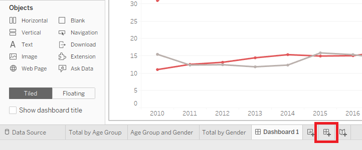


```

```{r out.width='3500px', out.extra='style="float:left; padding:10px"', echo = FALSE}
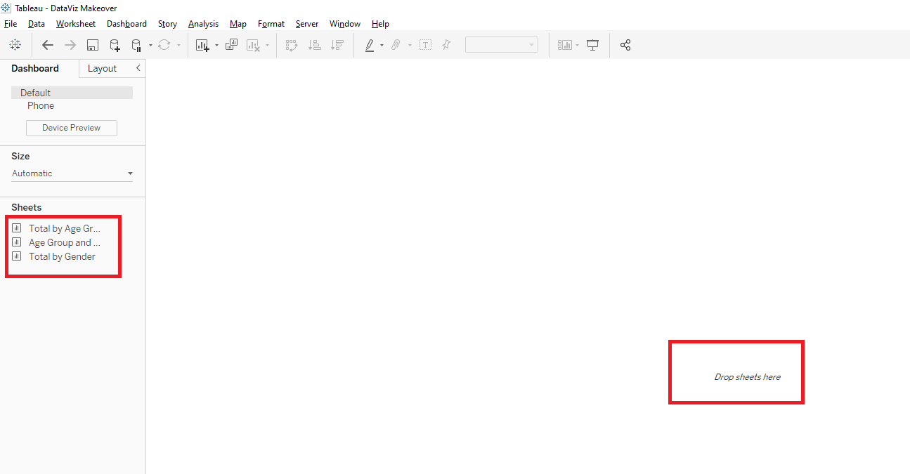


```


## Final Data Visualisation

```{r out.width='3500px', out.extra='style="float:left; padding:10px"', echo = FALSE}
knitr::include_graphics("Dataviz.png")


```


## Major observations from Final Data Visualisation

1) Amongst various age groups, workers aged 25 - 59 continue to maintain a high Labour Force Participation Rate as they constitute the majority of the workforce.

2) However, for workers aged 20 - 24, the Labour Force Participation Rate have decreased, and for workers aged 60 and above, the Labour Force Participation Rate has increased. A possible explanation for this could be due to the young adults pursuing growth opportunities such as taking up further tertiary education or upskilling themselves before entering the workforce.

3) For gender comparison, Labour Force Participation Rate had increased for females aged 25 and above from 2010 to 2021.

4) Also, Labour Force Participation Rate had risen by nearly 8% from 2010 to 2021 for women, but remains fairly constant for men.

## Reference

1. [Ministry of Manpower Statistical Table: Labour Force](https://stats.mom.gov.sg/Pages/LabourForceTimeSeries.aspx)
2. [Data Visualization: Clarity or Aesthetics?](https://dataremixed.com/2012/05/data-visualization-clarity-or-aesthetics/)
3. [Preattentive Visual Properties and How to Use Them in Information Visualization](https://www.interaction-design.org/literature/article/preattentive-visual-properties-and-how-to-use-them-in-information-visualization)
4. [The Fine Line In a Gray Area: When to Use Line vs Area Charts](https://rockcontent.com/blog/line-vs-area-charts/#:~:text=Line%20charts%20are%20good%20at,comparing%20them%20against%20each%20other.&text=Area%20charts%20show%20a%20filled,are%20on%20the%20same%20chart.)