```{r setup, include=FALSE}
knitr::opts_chunk$set(echo = FALSE)
```

## 1. Introduction

In this DataViz Makeover, we shall be critiquing the following data visualisation in terms of **clarity**, **aesthetic** and **interactivity**, before suggesting an alternative graphical presentation to improve on the data visualisation. The proposed alternative data visualisation will be designed in **Tableau** with the step-by-step description on how to do so listed below. Lastly, important observations will be noted based on the new visualisation created.


### 1.1 Data Visualisation

```{r out.width='3500px', out.extra='style="float:left; padding:5px"', echo = FALSE}
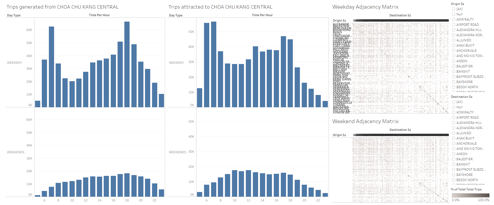


```
*Fig 1. Data visualisation based on data provided by LTA Datamall and URA*


## 2. Critique

### 2.1 Clarity
**(a) Poor labelling of y-axis title (for bar graph):** The y-axis title of the bar charts are unclear. Although there are two different rows of charts, one for *WEEKDAY* and one for *WEEKEND*, it is not clear what the numbers on the y-axis means. A better title such as *WEEKDAY TRIP COUNT* would help clarify the meaning.

**(b) Poor labelling of x and y-axis title (for adjacency matrix):** The axis titles of the adjacency matrices should be made clearer. Short form should be spelled out in full, for example *Destination Sz* and *Origin Sz* should be spelled out fully.

**(c) Missing labels for y-axis (for adjacency matrix):** The y-axis labels for *Weekend Adjacency Matrix* are missing.This makes it hard for the reader to glean any information from the adjacency matrix. The y-axis labels should be included for greater clarity of the visualisation.

**(d) Axis labels are too compressed and cluttered (for adjacency matrix):** The axis labels of the adjacency matrices are compressed and unreadable, especially for the x-axis. The inclusion of so many labels in such a small space also compresses the visualisation and makes it hard for the reader to extract any form of information from the adjacency matrix.


### 2.2 Aesthetic
**(a) Colours (for bar graph):** The colours for *WEEKDAY* and *WEEKEND* bar graphs are the same. Changing the colour for one of the bar graph sets would help viewers distinguish the information better.

**(b) Filter location (for bar graph):** The filter card for the bar charts are located on the right, beside the adjacency matrix. The filter card should be on the left, beside the bar charts to make it more intuitive for the viewer to recognise that the filtering options are for the bar charts.

**(c) Colours (for adjacency matrix):** The colour scheme chosen for the adjacency matrix is the same colour for all the subzones and does not make use of certain colours to highlight any unique information or findings. This makes it hard for the viewer to differentiate between the different subzones.


### 2.3 Interactivity
**(a) No interactivity for Adjacency Matrix:** There are no options to interact with the Adjacency Matrix, for example to filter out certain subzones to study the data in greater detail. 

**(b) Limited interactivity for bar charts:** Although there are options to interact with the bar charts by changing the stations, it would be better to create an interactive option to toggle between *WEEKDAY* and *WEEKEND*, such that it eliminates the need to create extra charts.


## 3. Proposed Design

```{r out.width='3500px', out.extra='style="float:left; padding:10px"', echo = FALSE}
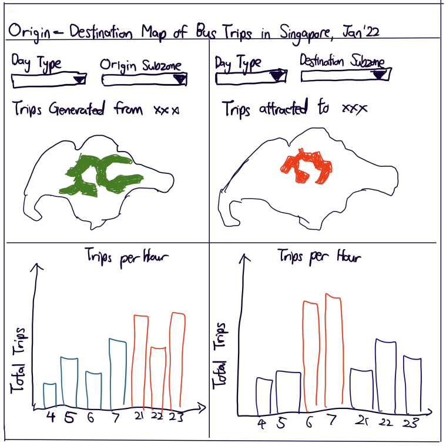


```

The proposed design aims to alleviate the flaws in the original design through the following:

**(a) Adjacency Matrix converted to Geographical map:** The adjacency matrix visualisation makes it hard for the reader to extract any form of information due to the cluttered labelling of a large number of labels. Hence, an option is given to viewers to select the individual subzones and view the adjacency relationships to that subzone.

**(b) Title clarity:** The titles for all charts have been reworded to provide greater clarity for viewers. 

**(c) Colours (for bar graph):** The top 3 trip counts per time period are highlighted in a different colour to allow viewers to note the peak periods for that subzone.

**(d) Filter locations:** The filter options are placed at the top of each graph that makes it more intuitive for viewers to understand which filter is for which chart.

**(e) Added information:** Text boxes were added to the visualisation to explain each chart.


## 4. Preparation of Data Visualisation


Step | Description |Action
-----|-------------|--------
1    |In Tableau, upload the .shp file given by clicking on *Spatial file* indicated| 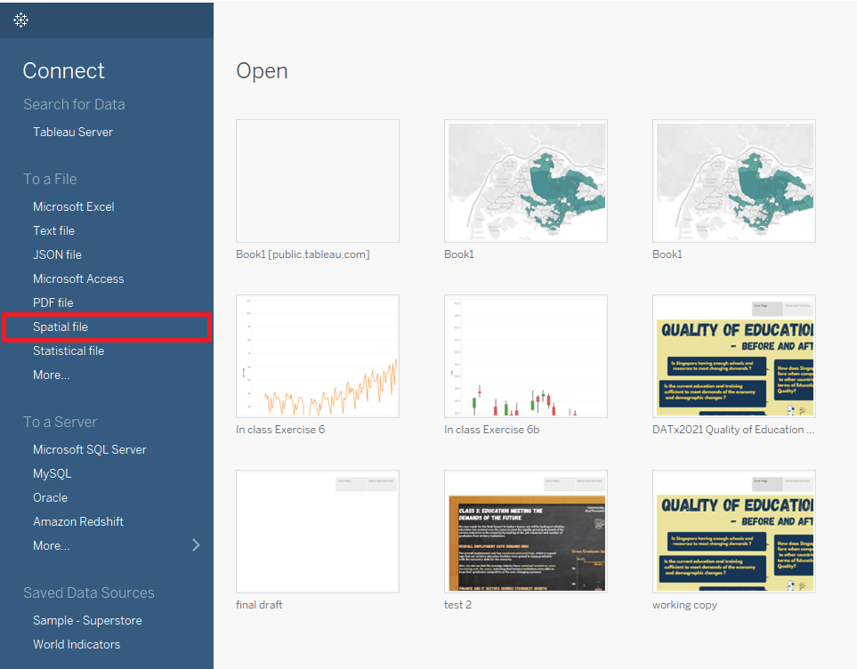{width=450px}
2    |Add the .csv file to the data sources list by clicking on *Add*, then selecting *Text file*.| 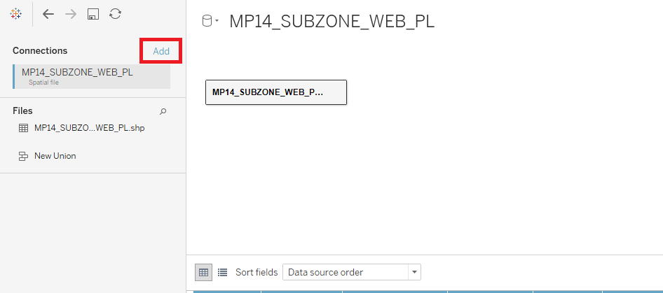{width=450px}
3    |Drag the .csv data table to the empty space as indicated.| 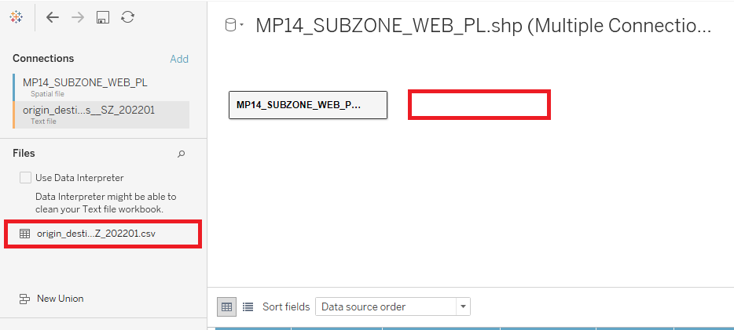{width=450px}
4    |When prompted to edit relationship, select *Subzone N* and *Origin Sz* respectively.|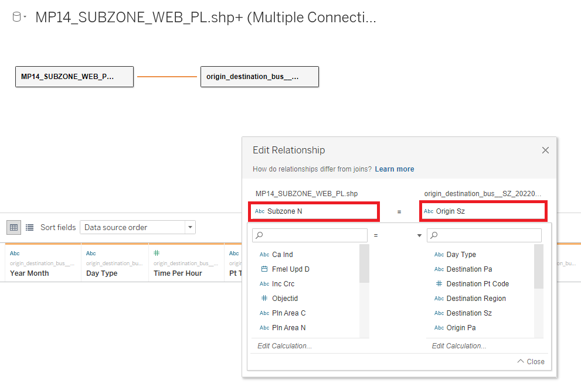{width=450px}
5    |Drag another .csv data table to the empty space as indicated.|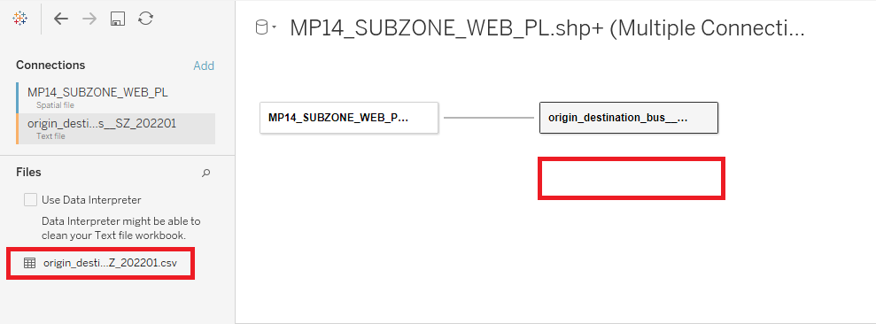{width=450px}
6    |When prompted to edit relationship, select *Subzone N* and *DESTINATION_SZ* respectively.|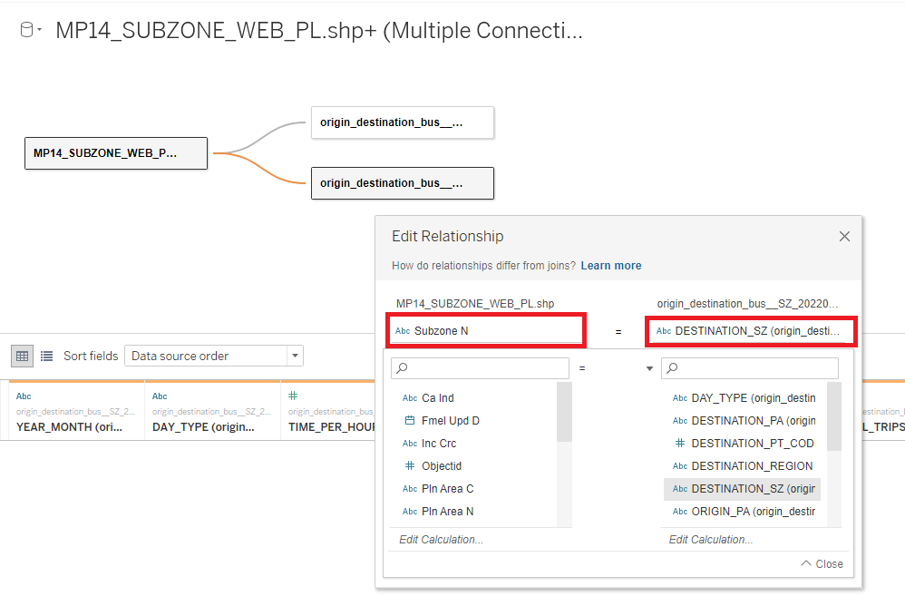{width=450px}
7    |Create a new sheet, and rename it *Origin*. Drag the *Geometry* card to the **Marks** card.|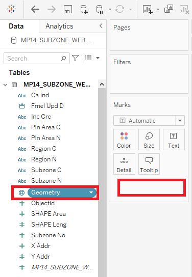{width=450px}
8    |Drag the *Latitude (generated)* card to the **Rows** shelf. Click on the dropdown arrow on one of the cards and select *Dual Axis*.|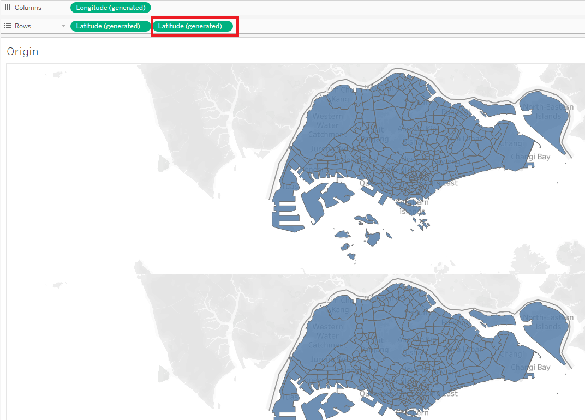{width=450px}
9    |For the first **Marks** tab, *Latitude (generated)*, drag the following cards to it. For one of the *SUM([Total Trips])*, click on the dropdown arrow, select *Quick Table Calculation*, and select *Percent of Total*|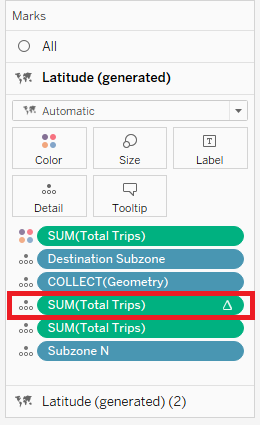{width=450px}
10   |For the second **Marks** tab, *Latitude (generated)(2)*, drag the following cards to it. For one of the *SUM([Total Trips])*, click on the dropdown arrow, select *Quick Table Calculation*, and select *Percent of Total*|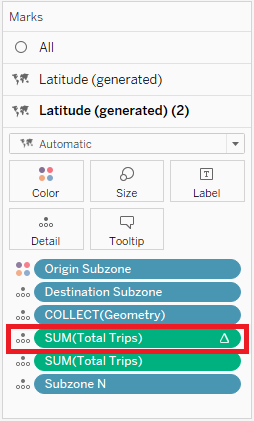{width=450px}
11   |Add *Origin Sz* and *Day Type* to the **Filters** card. |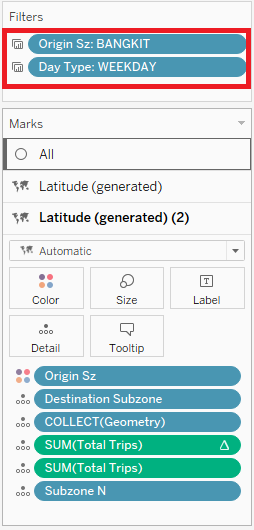{width=450px}
12   |Select *All* under the pop-up. |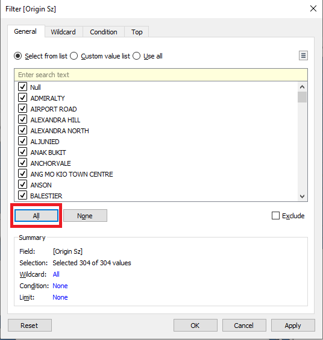{width=450px}
13   |Click on the dropdown for *Origin Sz* Filter, and click on *Show Filter*. Under the filters created on the right, select the dropdown arrow and select *Single Value (dropdown)*.|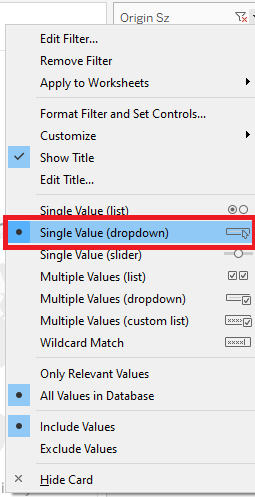{width=450px}
14   |Repeat for *Day Type* filter.|
15   |Create a new sheet, and rename it *Destination*. Repeat step 7.|
16   |Drag the *Latitude (generated)* card to the **Rows** shelf. Click on the dropdown arrow on one of the cards and select *Dual Axis*.|{width=450px}
17   |For the first **Marks** tab, *Latitude (generated)*, drag the following cards to it. For two of the *SUM([Total Trips])*, click on the dropdown arrow, select *Quick Table Calculation*, and select *Percent of Total*|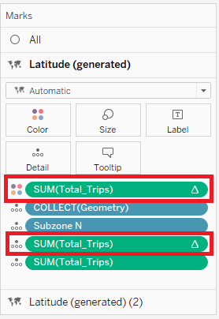{width=450px}
18   |For the second **Marks** tab, *Latitude (generated)(2)*, drag the following cards to it. For one of the *SUM([Total Trips])*, click on the dropdown arrow, select *Quick Table Calculation*, and select *Percent of Total*|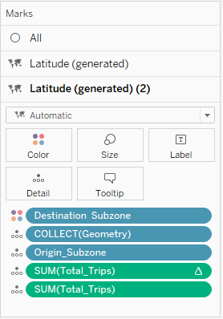{width=450px}
19   |Add *DESTINATION_SZ* and *DAY_TYPE* to the **Filters** card. |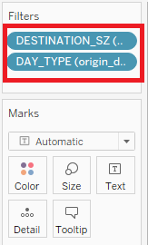{width=450px}
20   |Select *All* under the pop-up. |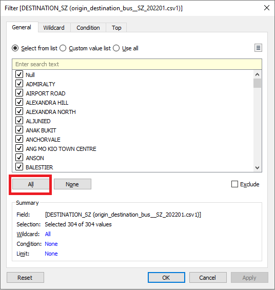{width=450px}
21   |Click on the dropdown for *DESTINATION_SZ* Filter, and click on *Show Filter*. Under the filters created on the right, select the dropdown arrow and select *Single Value (dropdown)*.|
22   |Repeat for *DAY_TYPE* filter.|
23   |Create a new sheet and rename it *Origin Bar*. Create a new Calculated Field, *Top 3 Origin*, as follows.|{width=450px}
24   |Drag the following cards to the respective shelves.|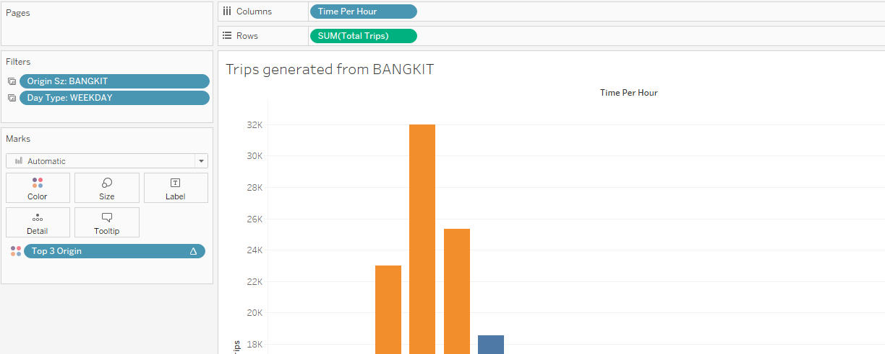{width=450px}
25   |Create a new sheet and rename it *Destination Bar*. Create a new Calculated Field, *Top 3 Origin*, as follows.|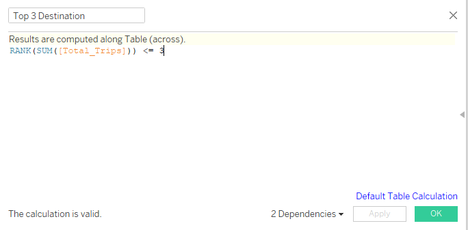{width=450px}
26   |Drag the following cards to the respective shelves.|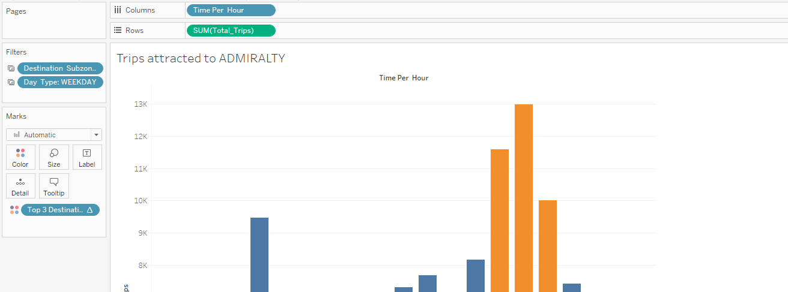{width=450px}
27   |Return to the *Origin* sheet, and click the dropdown arrow on the *Origin Sz* filter. Select *Apply to Worksheets*, *Selected worksheets* and select *Origin* and *Origin Bar*.|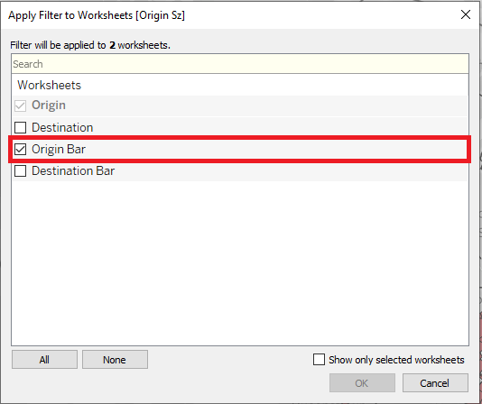{width=450px}
28   |Click the dropdown arrow on the *Day Type* filter. Select *Apply to Worksheets*, *Selected worksheets* and select *Origin* and *Origin Bar*.|
29   |Return to the *Destination* sheet, and click the dropdown arrow on the *DESTINATION_SZ* filter. Select *Apply to Worksheets*, *Selected worksheets* and select *Destination* and *Destination Bar*.|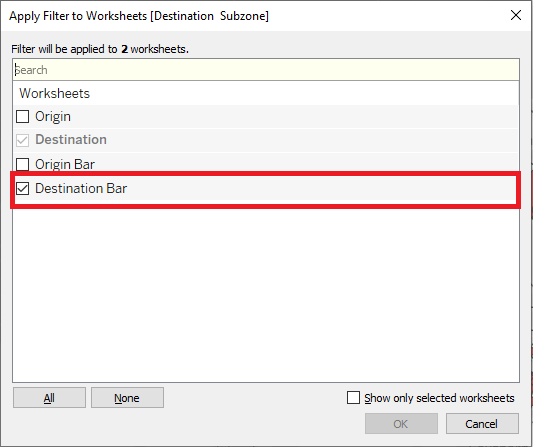{width=450px}
30   |Click the dropdown arrow on the *DAY_TYPE* filter. Select *Apply to Worksheets*, *Selected worksheets* and select *Destination* and *Destination Bar*.|
31   |Create a dashboard, and drag the sheets to the dashboard as follows.|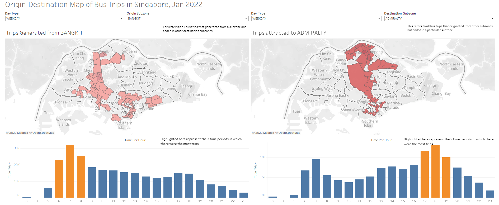{width=450px}

## 5. Final Data Visualisation

```{r out.width='3500px', out.extra='style="float:left; padding:10px"', echo = FALSE}


```

## 6. Major observations from Final Data Visualisation

**(a) Weekday Peak period:** We observe that across all subzones, the peak periods during weekdays are hours 7, 17 and 18. This could be due to the rush hour periods coinciding with these hours, where people are rushing to work in the morning and going home after work in the evening.

**(b) Flow of bus traffic to and from districts:** Commercial and work districts tend to receive traffic in high volumes in the morning, and heartland districts tend to receive traffic in high volumes in the evening. This could be because citizens were going to work in the morning in these commercial and business districts, and headed home in the evening to the heartland districts.

**(c) Weekend Peak period:** We observe that across all subzones, the peak periods during weekends are in the morning, around hours 10 and 11. This could be because citizens would head out in the morning to spend their well-deserved rest.

**(d) Weekend trips:** We observe that the weekend trip count is much lesser than the weekday trip count. This could be because some citizens may stay at home during the weekends, or take other modes of transport instead of bus to their destinations, such as private cars.