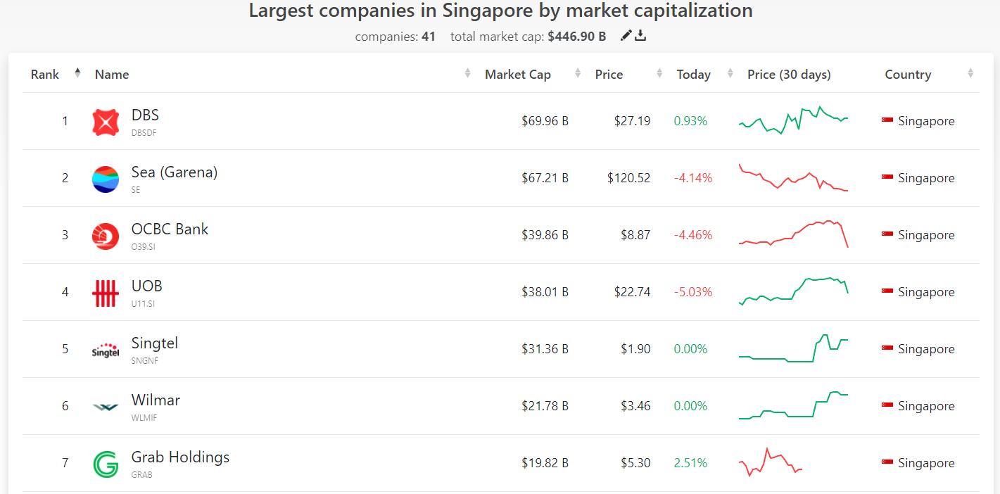

```{r setup, include=FALSE}
knitr::opts_chunk$set(echo = FALSE)
```

## Task

In this exercise, we shall perform the following:

1) Script stock prices of top 40 companies in Singapore by market capitalisation between 1st January 2020 - 31st December 2021 by using *tidyquant* R package

2) Prepare a data visualisation showing the historical stock prices by the top 40 companies by market capitalisation Using either calender heatmap or horizon graph.


## Data Preparation

### Installing and Launching R Packages

Before we get started, we will need to install the relevant R packages. 

```{r echo = TRUE}
packages = c('tidyverse', 'knitr', 'rmarkdown', 'tidyquant', 'lubridate', 'ggthemes', 'data.table', 'ggHoriPlot')

for(p in packages){library
  if(!require(p, character.only = T)){
    install.packages(p)
  }

  library(p, character.only = T)
}
```

### Scripting of stock prices

In order to extract the stock prices, the following [website](https://companiesmarketcap.com/singapore/largest-companies-in-singapore-by-market-cap/) was visited.

```{r out.width='3500px', out.extra='style="float:left; padding:10px"', echo = FALSE}



```

After which, the list of companies by market capitalisation was downloaded in *csv* format. The data in the *csv* file was then imported into R via the *read.csv* function. Once the data was imported, the top 40 companies were filtered out from the data table.

```{r}
top40 <- read.csv("data/SGCompanies.csv")
top40 <- head(top40,40)
head(top40)

```

Now that we have the symbols for the top 40 companies by market capitalisation, we are able to use the *tidyquant* package to extract out the stock prices over the time period of 1st January 2020 - 31st December 2021.

First, we extract out the symbols in vector form before keying in the dates in the *from_date* and *to_date* sections. After which, we employ the *tidyquant* function *tq_get* in order to extract out the stock prices for the top 40 companies.

```{r}
symbol <- as.vector(top40$Symbol)

from_date = "2020-01-01"
to_date = "2021-12-31"
stock_selected = symbol 

stock_data_weekly = tq_get(stock_selected,
               get = "stock.prices",
               from = from_date,
               to = to_date) %>%
               group_by(symbol) %>%
               tq_transmute(select     = NULL, 
                            mutate_fun = to.period, 
                            period     = "weeks", 
                            col_rename = "weekly percentage change")

paged_table(stock_data_weekly)

```

In order to visualise the stock prices in a coherent manner, the weekly rate of change of stock prices were used.

```{r}

stock_data_weekly$change <- ((stock_data_weekly$adjusted/shift(stock_data_weekly$adjusted)) - 1 )*100

```


## Data Visualisation

Lastly, we will build a horizon plot using ggplot2 to visualise the stock prices.

```{r}

ggplot() +
  geom_horizon(aes(date, close),
               data = stock_data_weekly) +
  scale_fill_hcl(palette = 'RdBu') +
  facet_grid(symbol~.)+
   theme_few() +
  theme(
    panel.spacing.y=unit(0, "lines"),
    plot.title = element_text(size=12),
    plot.subtitle = element_text(size=9),
    strip.text.y = element_text(size = 5, angle = 0, hjust = 0),
    axis.text.y = element_blank(),
    axis.title.y = element_blank(),
    axis.ticks.y = element_blank(),
    axis.text.x = element_text(size = 7, angle = 90, hjust = 0, vjust = 0.5),
    axis.title.x = element_blank(),
    panel.border = element_blank(),
    legend.position="none"
    ) +
  scale_x_date(expand=c(0,0), 
               date_breaks = "1 month", 
               date_labels = "%b '%y",
               limit=c(as.Date("2020-01-01"),as.Date("2021-12-31"))) +
  xlab('Date') +
  ggtitle('Stock Prices of Top 40 Companies in Singapore, 2020 to 2021', 
          'Ranked by Market Capitalisation, Weekly Data')


```

## Data Insights

Looking at the data visualisation, we are able to identify certain areas of interest.

1) Between the time period of April 2020 to November 2020, we can see a sharp decrease in most companies' closing stock prices. This could be due to the onset of COVID-19, which negatively impacted many businesses sharply. Hence, we can see the closing stock prices highlighted in bright red.

2) Secondly, we can see that stock prices for the top 40 companies started to recover around the time period of April 2021 to December 2021. This can be seen by most companies closing stock prices being highlighted in blue.

3) Lastly, we can see that some companies did not manage to recover fully, as indicated by the red colouring on their closing stock prices. Such companies include City Developments (C09.SI), ComfortDelGro (C52.SI) and Triterras (TRIT).

